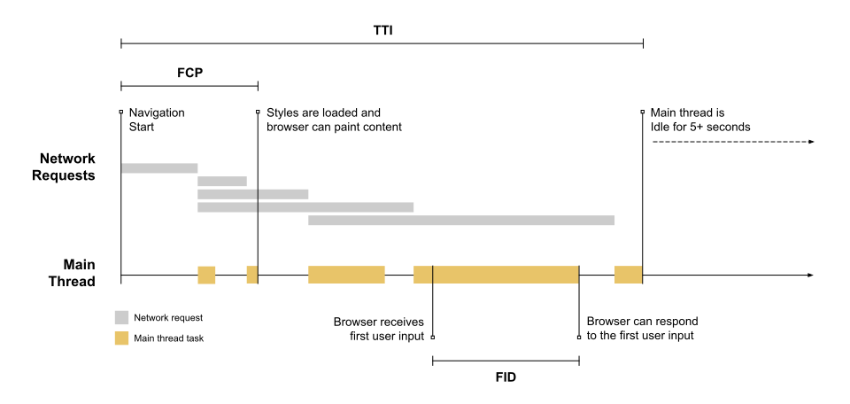

# until_first_input ( Time to first input )
measrure page performance until user first input event triggered

User Input events including: 
- mouse events (click, double click)
- wheel events (scroll, zoom)

A good expaination on FID in following picture by Philip Walton : https://web.dev/fid/

The Event Timing API(performance.getEntriesByType('first-input');) supported since Chrome 77+

Reference: 
Sample pages borrowed from Mozilla Developer Network: http://mdn.github.io/performance-scenarios/js-worker/index.html
